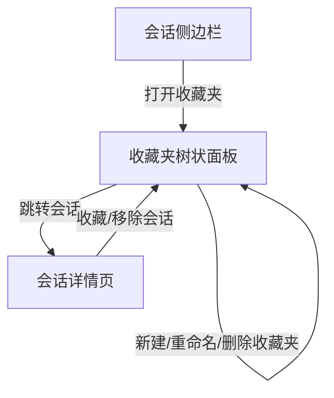

# 收藏夹功能产品需求文档（PRD）

## 一、功能描述

- 用户拥有一个默认收藏夹，并可新建、删除、重命名收藏夹（支持自定义名称，名称唯一且不可为空）。
- 收藏夹以树状结构展示，支持点击、拖拽等操作。
- 收藏夹下可添加/移除会话（会话ID），支持批量操作。
- 会话详情页右上角可快捷添加/移除该会话到任意收藏夹。
- 收藏夹数据后端独立存储，前端与后端同步。

## 二、交互流程

1. 用户点击“收藏夹”入口，弹出树状收藏夹面板。
2. 可新建、重命名、删除收藏夹（默认收藏夹不可删除）。
3. 拖拽/选择会话到收藏夹，或在会话详情页右上角操作。
4. 收藏夹内展示会话列表，点击可跳转到对应会话。
5. 支持从收藏夹中移除会话（不影响会话本身）。

## 三、边界与异常

- 收藏夹名不可重名、不可为空。
- 删除收藏夹时需二次确认，默认收藏夹不可删除。
- 会话被移除出所有收藏夹时，不影响其在主会话列表的存在。
- 收藏夹为空时显示“暂无收藏内容”。

## 四、后端设计

### 1. 数据结构

- 收藏夹（Folder）：
  - `folder_id`（str, 唯一）
  - `name`（str, 用户自定义）
  - `conversation_ids`（List[str]，会话ID集合）
  - `created_at`、`updated_at`
  - `is_default`（bool，是否为默认收藏夹）

- 存储方式：单独 JSON 文件（如 folders.json）或 sqlite 表，推荐 JSON 文件与现有会话一致。

### 2. API设计（RESTful）

| 方法   | 路径                          | 说明                   |
|--------|-------------------------------|------------------------|
| GET    | /api/v1/folders/              | 获取所有收藏夹及内容   |
| POST   | /api/v1/folders/              | 新建收藏夹             |
| PATCH  | /api/v1/folders/{id}          | 重命名收藏夹           |
| DELETE | /api/v1/folders/{id}          | 删除收藏夹             |
| POST   | /api/v1/folders/{id}/add      | 添加会话到收藏夹       |
| POST   | /api/v1/folders/{id}/remove   | 从收藏夹移除会话       |

#### 示例 Folder JSON
```json
[
  {
    "folder_id": "default",
    "name": "默认收藏夹",
    "conversation_ids": ["abc123", "def456"],
    "created_at": "...",
    "updated_at": "...",
    "is_default": true
  },
  {
    "folder_id": "custom1",
    "name": "工作",
    "conversation_ids": ["xyz789"],
    "created_at": "...",
    "updated_at": "...",
    "is_default": false
  }
]
```

### 3. 逻辑说明

- 用户初次使用自动生成“默认收藏夹”。
- 新建收藏夹时校验名称唯一性。
- 添加/移除会话时仅操作ID集合，不影响会话本体。
- 删除收藏夹时，收藏夹内会话不会被删除。

## 五、前端设计

### 1. 组件结构建议

- ConversationSidebar.vue：增加“收藏夹”入口按钮，弹出收藏夹树状面板。
- 新增 FolderTree.vue 组件：树状展示所有收藏夹及其会话，支持新建/重命名/删除/拖拽/点击。
- 会话详情页（如 ChatWindow.vue 或 MessageItem.vue）：右上角增加“收藏”按钮，弹出收藏夹选择面板。

### 2. 主要交互

- 收藏夹面板：支持新建、重命名、删除收藏夹，支持拖拽/多选会话添加到收藏夹。
- 收藏夹节点下展示会话列表，点击跳转。
- 收藏/移除操作后自动刷新收藏夹数据。
- 收藏夹与主会话列表数据解耦，收藏夹仅为“快捷访问”分组。

### 3. API对接

- 获取收藏夹及内容：页面初始化或收藏夹面板打开时调用 GET /api/v1/folders/
- 新建/重命名/删除收藏夹：对应 POST/PATCH/DELETE
- 添加/移除会话：会话详情页或拖拽操作时调用 POST /add 或 /remove

### 4. UI建议

- 收藏夹面板采用树状结构，支持折叠/展开。
- 收藏夹操作按钮（新建、重命名、删除）置于面板顶部或节点右侧。
- 收藏/移除按钮采用星形或文件夹图标，悬浮提示。

## 六、Mermaid 结构示意



## 七、技术实现要点

- 后端：复用 FastAPI 路由风格，新增 folders.py，数据与会话分离，接口风格一致。
- 前端：复用 fetch 逻辑，新增 FolderTree 组件，UI风格与现有侧边栏统一。
- 收藏夹与会话为多对多关系（会话可被多个收藏夹收录，收藏夹可包含多个会话）。
- 收藏夹操作需有异常处理与用户提示。
