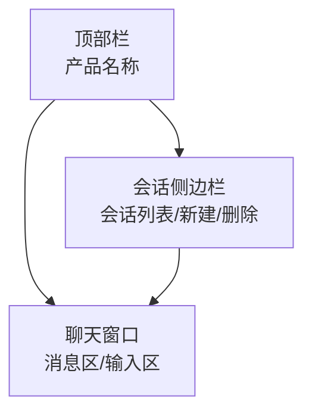

以下是**优化后的产品需求文档**，重点在于逻辑结构更清晰、措辞更简练专业、交互与边界处理描述更规范，方便团队开发与后期维护：

---

# 产品需求文档

## 一、产品定位

本产品是基于大语言模型的多轮对话演示系统，支持多会话管理与智能问答，适用于 AI 助手、在线客服等场景，旨在展示自然语言理解与上下文记忆能力。

## 二、核心功能

- **多会话管理**：支持新建、切换、删除会话，自动保存历史记录。
- **智能对话**：支持与 AI 助手进行多轮交互，实时响应用户输入。
- **会话摘要**：会话列表展示标题与最新消息摘要，提升浏览效率。
- **消息清空**：一键清空当前会话内容，便于重置对话上下文。

## 三、界面设计

### 1. 总体布局

- **顶部栏**：居中显示产品名称，固定高度，蓝色背景。
- **主内容区**：
  - 左侧为会话列表侧边栏；
  - 右侧为聊天窗口；
- **响应式设计**：兼容桌面与移动端浏览。

### 2. 色彩与样式规范

| 元素         | 颜色           | 描述                 |
|--------------|----------------|----------------------|
| 主色调       | `#409EFF`      | 按钮、顶部栏主色     |
| 背景色       | `#f5f5f5`      | 页面整体背景         |
| 侧边栏背景   | `#f7faff`      | 会话列表区域         |
| 聊天窗口背景 | `#ffffff`      | 主内容区域背景       |
| 当前会话高亮 | `#dbefff`      | 突出选中项           |
| 边框/分隔线  | `#e0e0e0`, `#eee` | 弱边界与结构线     |
| 按钮         | 默认：`#409EFF` 禁用：`#b3d8ff` 删除：`#ff4d4f` |
| 圆角         | 窗口：8px 按钮：4px |

### 3. 主要模块说明

#### （1）顶部栏

- 高度：48px；
- 背景色：主色；
- 字体：白色，20px，居中对齐；
- 不包含其他交互元素。

#### （2）会话侧边栏（宽度：240px）

- 背景色：浅蓝；
- 顶部区域：固定区域，含“会话列表”标题与“新建会话”按钮；
- 会话项展示：标题 + 最新消息摘要；
- 当前会话高亮背景；
- 删除按钮悬浮显示于右侧，使用红色图标。

#### （3）聊天窗口

- 背景白色，圆角卡片风格，带轻微阴影；
- **消息区**：上方区域，支持滚动显示全部历史消息，由 `MessageItem` 渲染；
- **输入区**：底部区域，含输入框、发送按钮、清空按钮；
  - 输入框：圆角，浅灰边框；
  - 按钮：主色填充，白字，圆角；
  - 特殊状态提示：包括“AI 正在思考...”或错误提示样式。

## 四、用户交互逻辑

| 操作             | 行为说明                                             |
|------------------|------------------------------------------------------|
| 新建会话         | 点击按钮，创建新会话并自动切换到该会话               |
| 切换会话         | 点击会话项加载对应历史消息，右侧窗口同步更新         |
| 删除会话         | 点击删除图标移除对应项，若当前会话被删则切换到第一个 |
| 发送消息         | 回车或点击“发送”按钮，AI 自动生成并追加回复         |
| 清空当前会话     | 清除当前会话的所有消息记录，不影响其他会话           |

## 五、字体与适配

- **字体**：`Segoe UI`, `PingFang SC`, `Hiragino Sans`, `Arial`, sans-serif；
- **适配性**：支持 Chrome、Firefox、Edge 等主流浏览器，移动端支持触控滚动。

## 六、典型用户流程

1. 用户打开页面，系统加载历史会话列表，若为空则自动新建；
2. 用户点击任一会话项，右侧窗口加载对应历史消息；
3. 用户输入问题后点击“发送”或按回车键，AI 返回结果；
4. 若用户点击“清空”，则当前会话所有内容被移除；
5. 用户点击“新建对话”开始新的会话；
6. 用户点击“删除”按钮移除会话，当前会话被删则自动切换至首个。

## 七、异常与边界处理

- 网络异常：显示提示“消息发送失败，请重试”；
- 输入为空或 AI 正在响应时，禁用“发送”按钮；
- 删除当前会话后自动切换会话，若无剩余会话则自动创建；
- 会话列表为空时默认新建一条初始会话；

## 八、界面结构示意图（Mermaid）

## 九、术语说明

- **会话**：一组连续对话记录，含唯一 ID、标题、摘要与消息集合；
- **消息**：单条交互内容，包含角色（user/assistant）、文本内容；
- **摘要**：当前会话中最后一条消息内容，用于在列表中简略展示；
- **AI 助手**：后端接入的大语言模型，负责生成自动回复。